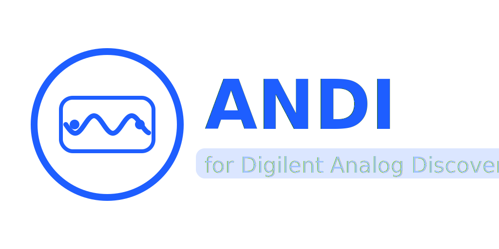

ANDI
====

**ANDI** is an open-source Python library to control **Digilent Analog Discovery**
instruments through the **WaveForms SDK**.

It provides a lightweight, practical API for:

- **Signal generation** (AWG) with common waveforms
- **Oscilloscope acquisition** (ADC), including triggering and buffering
- **Interactive workflows** (live plots, averaging, real-time acquisition)
- **Network characterization** (Bode / frequency response)

Getting started
---------------

1. Install the Digilent **WaveForms** application/runtime.
2. Install the Python package with `pip`: ``pip install andi-py``

3. Start with :doc:`user_guide/01_connection` and follow the example-driven guides.

Documentation map
-----------------

.. toctree::
   :maxdepth: 2
   :caption: User guide

   user_guide/index

.. toctree::
   :maxdepth: 2
   :caption: API reference

   api

Community & contributions
-------------------------

ANDI is maintained as an open-source project. Issues and pull requests are welcome:

- Prefer small, focused PRs with clear motivation.
- For hardware-dependent changes, include a minimal example script under ``examples/``.
- Keep API behavior stable; document changes in the changelog/release notes.
